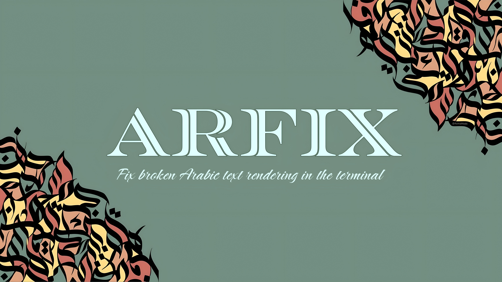

# arfix


**Fix broken Arabic text rendering in the terminal — built for Termux and every Debian-based Linux distribution.**

[](LICENSE)
[](https://www.python.org/)
[](#supported-platforms)
**Languages:** [العربية](README.ar.md)

---

## The Problem

Termux and many minimal Linux terminal environments do not implement two things that Arabic (and other RTL scripts) require to display correctly:

1. **Contextual shaping** — Arabic letters change shape depending on their position in a word (isolated, initial, medial, final). A terminal that doesn't shape text prints each letter in its isolated form, disconnected from its neighbors.
2. **Bidirectional (BiDi) reordering** — Arabic is read right-to-left, but the underlying text is stored left-to-right in memory (logical order). A terminal that doesn't implement the Unicode BiDi algorithm prints characters in the wrong visual order.

The result: text that should read as a connected word instead prints as disconnected, reversed letters — unreadable and visually broken.

This isn't a font problem, and installing a "better" font does not fix it. The terminal itself needs shaping/BiDi support it simply doesn't have. Termux in particular runs on Android's Bionic libc rather than glibc, and lacks the locale infrastructure and rendering pipeline that desktop Linux terminals normally rely on for this.

## The Solution

`arfix` performs shaping and BiDi reordering **in software, before printing**, so the terminal never has to do it. By the time text reaches the terminal, it's already in its correct, connected, visually-ordered form — the terminal just prints it like any other string of characters.

This works with **any regular font** that includes Arabic Unicode glyphs. No special font, no system locale configuration, no terminal emulator switch required.

### Why it installs cleanly on Termux specifically

Earlier iterations of this tool depended on the `python-bidi` package for BiDi reordering. Recent versions of `python-bidi` require compiling a Rust extension via `maturin`, and Rust's `aarch64-unknown-linux-android` target isn't supported by `rustup` — so installation fails outright on Termux.

`arfix` avoids this entirely. It depends only on [`arabic-reshaper`](https://pypi.org/project/arabic-reshaper/) (pure Python, no compiled extensions) for shaping, and implements its own minimal, pure-Python BiDi pass for the common terminal-output case (a line of Arabic text, optionally mixed with Latin text or digits). No Rust, no native build step, no compiler needed — installation is instant on Termux, and on any Debian-based distribution, out of the box.

## Features

- **`arfix`** — fix Arabic text directly, from an argument, a pipe, or a file
- **`smartcat`** — run any command and fix its output live, line by line, as it's produced
- **Auto-wrap shell hook** — optionally makes `cat`, `echo`, `grep`, `head`, and `tail` fix Arabic output automatically, with no extra typing
- **Non-Arabic text is never touched** — lines without Arabic characters pass through completely unchanged, so nothing else in your workflow breaks
- **Zero native dependencies** — pure Python, installs instantly on Termux and any Debian-based distribution
- **Dedicated `.deb` packages** for both Termux and Debian-based systems, built from the same source
- **Clean, fully automatic uninstall** — one command removes everything it set up

## Supported Platforms

`arfix` is built and packaged specifically for:

- **Termux** (Android) — the primary target this project was built to fix
- **Any Debian-based Linux distribution** — Debian, Ubuntu, Linux Mint, Kali Linux, Pop!_OS, Raspberry Pi OS, MX Linux, elementary OS, Zorin OS, and any other distribution built on the `dpkg`/`apt` packaging system

Both get first-class, dedicated `.deb` packages (see [Installation](#installation)). The core tool is also plain Python with a single pure-Python dependency, so it installs via `pip` on any system running Python 3.7+ — including non-Debian-based distributions — even though those aren't the primary packaging target.

## Installation

### Option 1 — `.deb` package (recommended for Termux and Debian-based distributions)

Build the packages from source:

```bash
git clone https://github.com/MRX7014/arfix.git
cd arfix
bash packaging/build-deb.sh
```

This produces two separate packages, since Termux and standard Debian-based systems use different filesystem layouts:

```bash
dpkg -i arfix-termux.deb    # Termux (Android)
dpkg -i arfix-debian.deb    # Debian, Ubuntu, Mint, Kali, Pop!_OS, Raspberry Pi OS, and other Debian-based distributions
```

Each package installs the Python package, sets up the `arfix` and `smartcat` commands, and enables the shell auto-wrap hook — no prompts, no follow-up steps.

### Option 2 — One-command install script

Works the same way on Termux or any Debian-based distribution, without needing `dpkg`:

```bash
git clone https://github.com/MRX7014/arfix.git
cd arfix
bash scripts/install.sh
```

### Option 3 — pip (any system running Python)

```bash
git clone https://github.com/MRX7014/arfix.git
cd arfix
pip install --break-system-packages .
```

Useful if you're on a non-Debian-based system (e.g. Arch, Fedora) and just want the `arfix`/`smartcat` commands without the `.deb` packaging or shell auto-wrap setup.

## Usage

### Command line

```bash
arfix "some arabic text here"          # fix and print text directly
echo "some arabic text here" | arfix   # fix text piped from another command
cat notes.txt | arfix                  # fix text piped from a file
arfix -f notes.txt                     # fix and print a file's contents directly
arfix -h                               # show full usage help
arfix -u                               # fully and automatically uninstall arfix
```

### `smartcat` — wrap any command automatically

Runs a command and fixes Arabic in its output live, as each line is produced:

```bash
smartcat cat notes.txt
smartcat ./my_script.sh
smartcat ping example.com
```

### Auto-wrap (no command needed at all)

If the shell hook was enabled during installation (it is by default with `install.sh` and both `.deb` packages), common commands are wrapped automatically for the rest of your terminal session:

```bash
cat notes.txt      # Arabic output fixed automatically
echo "..."         # same
grep "..." file    # same
head file.txt      # same
tail file.txt      # same
```

You never need to type `arfix` or `smartcat` for these — and any interactive full-screen program (`vim`, `nano`, `htop`, etc.) is unaffected, since those draw directly to the screen rather than printing lines.

### As a Python library

```python
from arfix import fix

print(fix("some arabic text here"))
```

`fix()` processes text line by line, so existing line breaks are preserved and lines without Arabic content are returned unchanged.

## Uninstalling

```bash
arfix -u
```

This is fully automatic and requires no follow-up action, on Termux or any Debian-based distribution alike:

1. Removes the auto-wrap block from `~/.bashrc`
2. Uninstalls the `arfix` Python package
3. Removes the `.deb` package registration, if arfix was installed that way

## Project Structure

```
arfix/
├── arfix/
│   ├── __init__.py              # Thin public API re-export (fix, main, etc.)
│   ├── core.py                  # Arabic detection, shaping, and BiDi logic
│   ├── cli.py                   # `arfix` / `smartcat` command-line entry points
│   └── uninstall.py             # Fully automatic removal logic for `arfix -u`
├── scripts/
│   ├── install.sh                # One-command installer
│   └── arfix-shell-hook.sh       # Shell function definitions for the auto-wrap feature
├── packaging/
│   ├── build-deb.sh             # Builds both .deb variants from source
│   ├── deb-termux/DEBIAN/       # control / postinst / prerm for the Termux build
│   └── deb-debian/DEBIAN/       # control / postinst / prerm for the Debian-based build
├── pyproject.toml               # Package metadata and entry points
├── LICENSE
└── README.md
```

### Code organization

The `arfix` package is split by concern rather than kept as one file:

- **`core.py`** has no knowledge of the CLI or installation — it's the reusable library part (`fix`, `fix_line`, `has_arabic`), safe to import on its own.
- **`cli.py`** owns argument parsing and the `arfix`/`smartcat` entry points, and imports from `core.py`.
- **`uninstall.py`** owns the `.bashrc` cleanup, pip uninstall, and `.deb` removal logic for `arfix -u`, independent of argument parsing.
- **`__init__.py`** just re-exports the public API, so `from arfix import fix` and the `pyproject.toml` console-script entry points (`arfix:main`, `arfix:run_wrapped`) keep working unchanged.

## How It Works

1. **Detection** — each line is scanned for characters in the Arabic Unicode blocks (Arabic, Arabic Supplement, Arabic Extended-A, Arabic Presentation Forms). Lines with no Arabic characters are returned untouched.
2. **Shaping** — for lines containing Arabic, `arabic_reshaper.reshape()` converts each letter into its correct contextual form (isolated, initial, medial, or final) and joins them.
3. **BiDi reordering** — the shaped line is split into runs of Arabic-or-neutral text versus Latin/digit/symbol text. Run order is reversed for right-to-left visual display, and characters within each Arabic run are reversed (since reshaped glyphs are still stored in logical/typing order). This covers the common terminal-output case without implementing the full Unicode Bidirectional Algorithm.

## Limitations

- Covers line-based text output (`cat`, `echo`, script output, etc.). It does not — and cannot — fix interactive, full-screen terminal applications (`vim`, `nano`, `htop`) that control the screen directly rather than printing lines.
- The `.deb` packages are built specifically for Termux and Debian-based systems (`dpkg`/`apt`). They will not work on Arch Linux (`pacman`), Fedora/RHEL (`rpm`), or other non-Debian-based distributions — use the `pip` install method on those instead.
- The BiDi implementation handles the common case (Arabic text, optionally mixed with Latin text or digits) rather than the complete Unicode Bidirectional Algorithm. This covers virtually all real-world terminal output but is not a general-purpose BiDi engine for complex mixed-script documents.

## License

MIT — see [LICENSE](LICENSE).
